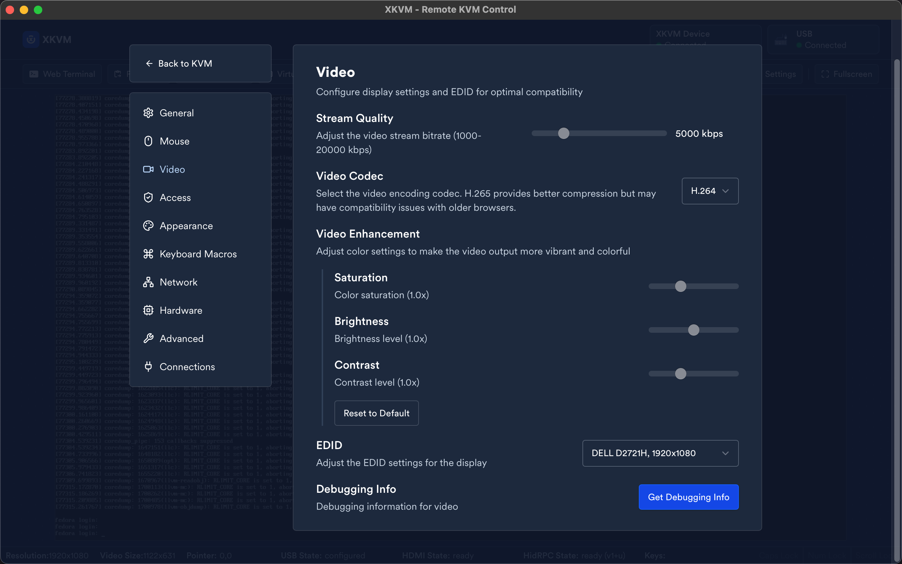
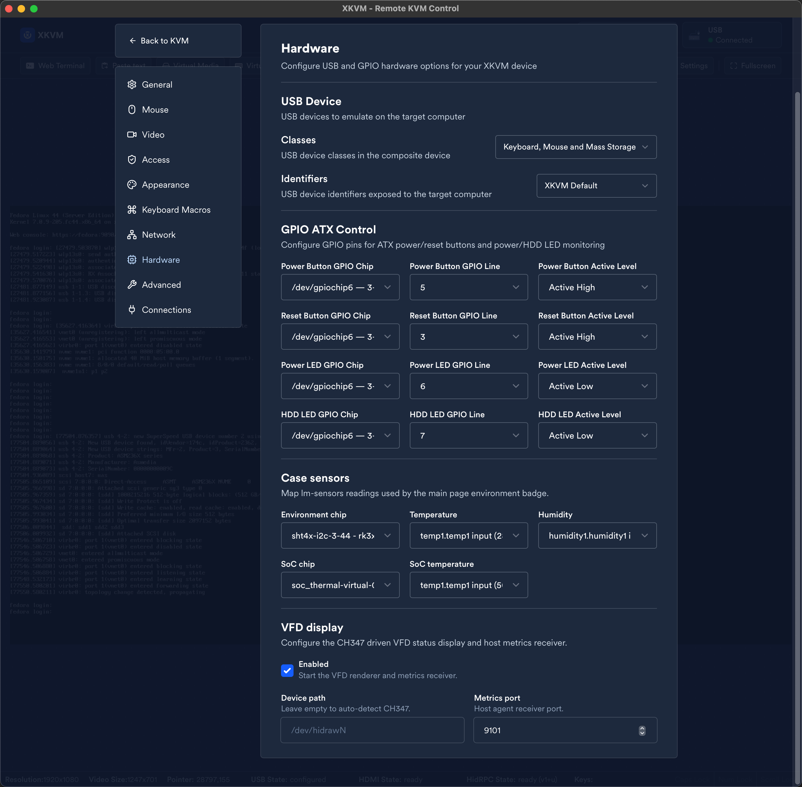
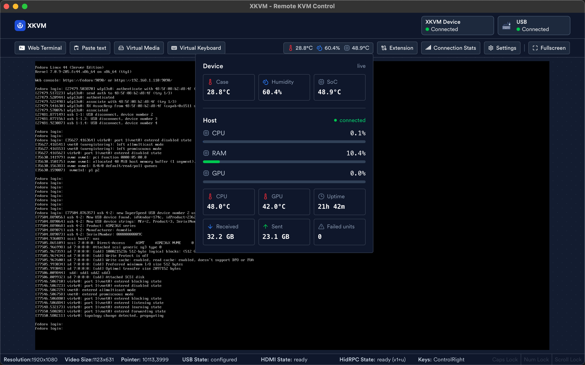

# XKVM

[English](README.en.md) | [简体中文](README.md)

XKVM is a high-performance, open-source, 100% local KVM-over-IP solution running on a full Linux system. It provides remote keyboard/mouse input and 1080p 60fps hardware-encoded video streaming for remote machine management.

This thing is currently only adapted to the KVM platform I built myself: Radxa Zero 3 (rk3566) + tc358743 HDMI-CSI capture card. My capture card hardware is opensourced on OSHWHub [here](https://oshwhub.com/gth38/hdmi-csi). It should be fairly easy to port to other RK platforms.

## Overview

XKVM is based on JetKVM. I removed a bunch of stuff I do not need, such as cloud connection, network configuration, device management, and so on. After all, this runs on a full Linux system instead of buildroot. I added 2M-20M bitrate control, H.265 encoding, and customizable GPIO-based ATX power control/monitoring. I also added Linux, Windows, and macOS native frontend apps based on Tauri, mainly to work around the annoying browser WebRTC security restrictions when connecting through VPNs like Tailscale.

This project is mainly for personal use. I may drop it at any time.

## Release

XKVM releases are currently split into three packages:

| Package | Install on | Role |
|---|---|---|
| `xkvm_<version>_arm64.deb` | The XKVM device | Main XKVM service package. It runs the KVM server, WebUI, video capture/encoding, USB HID control, virtual media, GPIO power control, and other device-side features. |
| `xkvm-host-agent-<version>-*.rpm` | The controlled host, when using host metrics monitoring or VFD display metrics | Optional host-side metric sender. It reports CPU, memory, GPU, temperature, network, uptime, and failed systemd unit status to the XKVM host metrics listener. |
| `XKVM-Connector_<version>_aarch64.dmg` | Apple Silicon macOS clients | Optional native macOS frontend. Use it when you prefer a desktop app or need to avoid browser WebRTC restrictions across VPN/cross-LAN connections. |

Most users only need the Debian package on the XKVM device. The host agent and macOS connector are optional companion packages for their specific use cases.

## File Paths

XKVM follows standard Linux FHS conventions. Paths can be overridden via environment variables.

| Path | Env Override | Purpose |
|---|---|---|
| `/etc/xkvm/` | `XKVM_CONFIG_DIR` | Configuration files |
| `/var/lib/xkvm/` | `XKVM_DATA_DIR` | Data files |
| `/var/log/xkvm/` | `XKVM_LOG_DIR` | Logs |

Main files:

| File | Description |
|---|---|
| `/etc/xkvm/kvm_config.json` | Main config (USB, video, auth, macros, etc.) |
| `/etc/xkvm/tls/` | TLS certificates |
| `/etc/xkvm/.native-debug-mode` | Create this file to enable native debug mode |
| `/var/lib/xkvm/images/` | Virtual media images (ISO/disk) |
| `/var/lib/xkvm/crashdump/` | Crash logs |
| `/var/log/xkvm/last.log` | Application stdout/stderr log |

When running through systemd, these directories are automatically created by `ConfigurationDirectory`, `StateDirectory`, and `LogsDirectory`.

## `/etc/xkvm/kvm_config.json`

Missing keys use built-in defaults. Deprecated rows are kept for old config compatibility. Most of the options could be configured in WebUI Settings page. Only edit them in case you messed up something with the WebUI.

| Key | Description | Values |
|---|---|---|
| `cloud_url` | Deprecated cloud/API base URL | deprecated; leave `""` |
| `public_ipv4_endpoint` `public_ipv6_endpoint` | Public IP lookup endpoints | URL/domain returning plain IP text; `""` disables that family |
| `localAuthMode` | Local authentication mode | `""`, `"password"`, `"noPassword"` |
| `hashed_password` `local_auth_token` | Local auth credentials | strings managed by local auth |
| `local_loopback_only` | Bind local access to loopback only | boolean |
| `tls_mode` | HTTPS certificate mode | `""`, `"self-signed"`, `"user-defined"` |
| `default_log_level` | Default logger level | `DISABLE`, `NOLEVEL`, `PANIC`, `FATAL`, `ERROR`, `WARN`, `INFO`, `DEBUG`, `TRACE` |
| `auto_update_enabled` `include_pre_release` | Deprecated OTA update behavior | deprecated/disabled; booleans kept for old configs |
| `video_quality_factor` | Video bitrate | kbps; UI normally uses `2000`-`20000` |
| `video_codec` | Video encoder | `0` = H.264, `1` = H.265 |
| `video_sleep_after_sec` | HDMI sleep timeout | `0` = default 60s, positive seconds, negative disables |
| `native_max_restart_attempts` | Native helper restart limit | unsigned integer |
| `keyboard_layout` | Keyboard mapping | `cs-CZ`, `da-DK`, `de-CH`, `de-DE`, `en-UK`, `en-US`, `es-ES`, `nl-BE`, `fr-CH`, `fr-FR`, `it-IT`, `ja-JP`, `nb-NO`, `sv-SE` |
| `keyboard_macros` | Saved keyboard macros | array of `{id,name,sortOrder,steps}`; max 25 macros, 10 steps, 10 keys per step |
| `hdmi_edid_string` | Saved HDMI EDID | EDID hex/base64 string as stored by the UI |
| `active_extension` | Loaded UI/control extension | `""`, `"dc-power"`, `"serial-console"` |
| `jiggler_enabled` | Mouse jiggler enable | boolean |
| `jiggler_config` | Mouse jiggler schedule/limits | `{inactivity_limit_seconds,jitter_percentage,` `schedule_cron_tab,timezone}`; timezone is IANA/`UTC` |
| `usb_config` | USB gadget identity | `{vendor_id,product_id,serial_number,` `manufacturer,product}`; IDs are hex strings like `0x1d6b` |
| `usb_devices` | USB gadget function switches | `{absolute_mouse,relative_mouse,` `keyboard,mass_storage}` booleans |
| `network_config` | Deprecated network settings | ignored on load and omitted on save |
| `gpio_pwr_chip/line/active_high` `gpio_rst_chip/line/active_high` `gpio_pwr_led_chip/line/active_high` `gpio_hdd_led_chip/line/active_high` | GPIO ATX/LED mappings | `chip` string, `line` integer (`-1` disables), `active_high` boolean |
| `sensor_env_chip` `sensor_soc_chip` | hwmon chip selectors | hwmon chip names |
| `sensor_temp_feature` `sensor_hum_feature` `sensor_soc_feature` | hwmon feature selectors | hwmon feature names |
| `host_metrics_enabled` `host_metrics_listen_port` `vfd_enabled` `vfd_device_path` | Host metrics receiver and VFD display support | booleans, TCP port, device path string |
| `serial_port_path` | Serial console device | serial device path; `""` disables serial console |
| `wake_on_lan_devices` | Deprecated Wake-on-LAN list | deprecated array of `{name,macAddress}` |

## Demo

Screenshots below are from the Tauri native desktop UI (macOS):

Video settings: 2M-20M bitrate control and H.264/H.265 codec switching (H.265 is macOS Safari only).

Hardware settings: USB device types, GPIO ATX control, case sensors, host metrics, and VFD display configuration.

Sensors and host metrics: the main UI can show device environment sensors, host load, temperature, network traffic, and runtime state.

## Contributing

Forks are welcome.

## License

See [LICENSE](LICENSE) for details.
