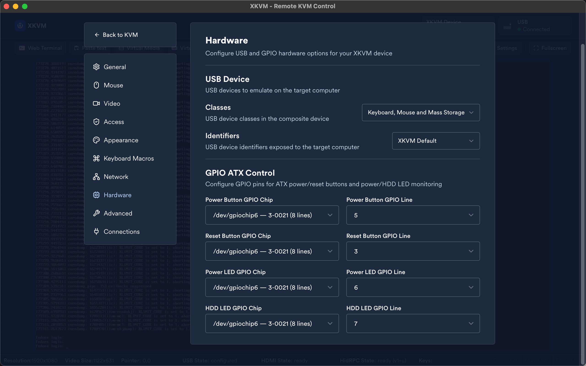

# XKVM

[English](README.en.md) | [简体中文](README.md)

XKVM 是一个高性能、开源、100% 本地的 KVM-over-IP 解决方案，运行在完整的 Linux 系统上。它提供远程键鼠输入、1080p 60fps的硬件编码视频流，用于远程管理机器。

这玩意目前只适配我自己搓的Radxa Zero 3 (rk3566) + tc358743 HDMI-CSI采集卡的KVM平台。采集卡硬件的立创开源地址[在此](https://oshwhub.com/gth38/hdmi-csi)。可以比较简单地移植到其他rk平台。

## 概述

XKVM基于JetKVM，删掉依大托我用不到的功能，比如云端连接，网络配置，设备管理等等（毕竟跑在一个完整的linux而非buildroot上）。添加了2M - 20M的码率调整以及H.265编码，可自定义GPIO的ATX电源控制与监控。同时还基于Tauri增加了Linux，Windows和MacOS的前端本地应用，用来解决使用tailscale等VPN进行跨LAN连接时恼人的浏览器WebRTC安全限制。

项目主要开发目的为个人自用，随时弃坑。其他细节见英文版readme。

## 配置文件路径

XKVM 遵循标准 Linux FHS 规范，路径可通过环境变量覆盖。

| 路径 | 环境变量 | 用途 |
|---|---|---|
| `/etc/xkvm/` | `XKVM_CONFIG_DIR` | 配置文件 |
| `/var/lib/xkvm/` | `XKVM_DATA_DIR` | 数据文件 |
| `/var/log/xkvm/` | `XKVM_LOG_DIR` | 日志 |

主要文件：

| 文件 | 说明 |
|---|---|
| `/etc/xkvm/kvm_config.json` | 主配置（USB、视频、认证、宏等） |
| `/etc/xkvm/tls/` | TLS 证书 |
| `/etc/xkvm/.native-debug-mode` | 创建此文件启用 native 调试模式 |
| `/var/lib/xkvm/images/` | 虚拟介质镜像（ISO/磁盘） |
| `/var/lib/xkvm/crashdump/` | 崩溃日志 |
| `/var/log/xkvm/last.log` | 应用标准输出/错误日志 |

通过 systemd 运行时，目录由 `ConfigurationDirectory`、`StateDirectory`、`LogsDirectory` 自动创建。

## 演示

以下截图来自 Tauri 原生桌面界面（macOS）:

视频设置：支持 2M–20M 码率调节，H.264/H.265 编码切换（H.265 仅限 macOS Safari）。

GPIO 硬件配置：ATX 电源控制与状态监测引脚配置。

## 贡献

欢迎fork。

## 许可证

详情请参阅 [LICENSE](LICENSE)。
